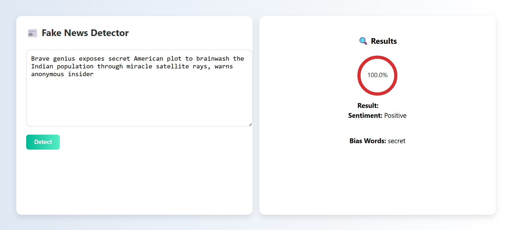

# 📰 Media Forensics AI - Frontend

This is the React-based frontend for **Media Forensics AI**, a fake news detection project.  
It connects to a Flask backend to analyze the **authenticity, sentiment, and bias** of a news article or headline.

<div align="center">
  
</div>

---

## 🚀 Features

- ✍️ Input any news text
- 🧠 Displays if the news is **Fake** or **Real**
- 🎯 Shows **confidence level** using a circular progress bar
- 📊 Provides **sentiment** (positive/negative)
- 🧩 Detects **bias-inducing words** (e.g., "secret", "miracle", etc.)

---

## 🛠 Tech Stack

- **React** with Hooks
- `react-circular-progressbar` for confidence visuals
- CSS Flexbox for clean two-panel layout
- Backend: [Flask API](https://github.com/BirendeepSingh/Media-Forensics-AI)

---

## 📦 Setup Instructions

```bash
git clone https://github.com/BirendeepSingh/media-forensics-frontend
cd media-forensics-frontend
npm install
npm start
